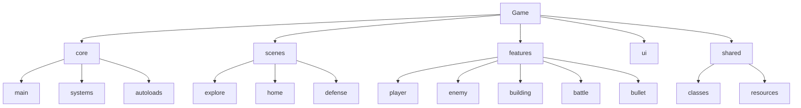

## 项目简介

这是一个基于 **Godot 4 + GDScript** 的 2D 游戏项目，核心循环为：

- 出战到探索/刷怪场景获取资源
- 回到基地进行建筑与塔防布局
- 通过塔防成功获得资源与成长，再次出战

本文件用于约束项目的目录结构、命名规范和脚本组织方式，并为后续在 Cursor/AI 中生成代码提供统一约定。

---

## 顶层目录结构约定（以 `Game` 为根）

顶层目录建议固定为以下几类（可逐步迁移现有内容）：

- `core/`：游戏主入口、全局系统、Autoload 单例
- `scenes/`：关卡级/大场景组合（探索 / 家园 / 塔防）
- `features/`：按“领域/功能”划分的模块（玩家、敌人、建筑、战斗、子弹等）
- `ui/`：UI、HUD、调试界面
- `shared/`：跨功能共享的通用类和资源

目录结构示意（仅展示逻辑层级，非必须一次建全）：

---

## 各目录职责与建议

### `core/` —— 核心系统与入口

- 位置示例：`Game/core`
- 职责：
  - 游戏主入口和流程控制
  - 全局系统（例如：昼夜循环、波次调度、存档系统等）
  - Autoload 单例（全局对象、全局信号、全局配置）
- 结构建议：
  - `core/main/`
    - `main_scene.tscn`：当前主场景（例如原 `scenes/test_scene.tscn` 重命名/迁移而来）
    - 将来扩展的“主菜单”“存档选择”等入口场景
  - `core/systems/`
    - `cycle_controller.tscn` + `cycle_controller.gd`
    - `monster_generator.tscn`（若有）+ `monster_generator.gd`
    - 其他系统级控制器，例如资源结算、任务系统等
  - `core/autoloads/`
    - `global_objects.gd`
    - `global_signal.gd`
    - `global_info.gd`
- 命名规则：
  - 系统级节点脚本统一使用 `XxxController.tscn` / `xxx_controller.gd`，类名 `XxxController`
  - Autoload 统一放在 `core/autoloads` 下（但在 `project.godot` 里照常配置）

### `scenes/` —— 关卡与大的场景组合

- 位置示例：`Game/scenes`
- 职责：只用于存放“场景级组合”，即包含多种 Feature/系统的完整关卡或界面
- 子目录建议：
  - `scenes/explore/`：探索/刷怪场景
    - 示例：`explore_forest_01.tscn`, `explore_debug_main.tscn`
  - `scenes/home/`：家园/基地建造场景
    - 示例：`home_camp_01.tscn`
  - `scenes/defense/`：塔防场景
    - 示例：`defense_01.tscn`
- 规范：
  - 不在 `scenes/` 下定义具体的单位/敌人/建筑逻辑脚本，这些应放在 `features/` 中并作为子场景或节点被引用

### `features/` —— 按领域划分的功能模块

- 位置示例：`Game/features`
- 职责：把当前的 `enemies/`, `buildings/`, `bullets/`, `battle/` 等内容按领域收敛，方便维护与扩展

#### `features/player/` —— 玩家模块

- 建议内容：
  - `Player.tscn`：玩家场景
  - `player.gd`：玩家控制与状态脚本
  - `player_data.gd`：玩家数值与成长数据脚本（从 `classes/player_data.gd` 迁移而来）
  - 其他相关资源：动画、贴图等，可以在此目录下建立 `animations/`, `sprites/` 等子目录
- 规范：
  - 玩家只通过明确的接口与以下系统交互：
    - 战斗系统：`BattleUnit` 等
    - 全局信号：`GlobalSignal`（如监听敌人死亡、昼夜变化）
    - 建筑系统：例如基地建成后解锁某些能力

#### `features/enemy/` —— 敌人与波次模块

- 建议迁移内容：
  - 从 `Game/enemies/`：
    - `enemy.tscn`, `skull.tscn`, `octopus.tscn`, `enemy_generator.tscn`
    - `enemy.gd`, `skull.gd`, `battle_search.gd`
  - 从 `Game` 根目录：
    - `octupus.gd`：统一改名整理为 `octopus.gd`，与 `octopus.tscn` 配对
    - `monster_generator.gd`：可选择放在 `features/enemy/waves/` 或 `core/systems/`，视更偏领域模块还是全局系统而定
- 结构建议：
  - `features/enemy/types/`：具体敌人类型及脚本
  - `features/enemy/waves/`：波次生成器、敌人调度逻辑

#### `features/building/` —— 建筑与塔防模块

- 建议迁移内容（来自原 `Game/buildings/`）：
  - `buildings.tscn`, `build_component.tscn`, `tower_basic.tscn`, `wave_tower_basic.tscn`, `farm_basic.tscn`, `base_camp.tscn`
  - `buildings.gd`, `build_component.gd`, `tower_basic.gd`, `wave_tower_basic.gd`, `farm_basic.gd`, `base_camp.gd`
- 子目录建议：
  - `base/`：例如 `buildings.gd` 等建筑基类与公共组件
  - `towers/`：所有塔（`tower_basic`, `wave_tower_basic` 等）
  - `economy/`：资源产出建筑，如农场
  - `camp/`：基地、营地类建筑，如 `BaseCamp`

#### `features/battle/` —— 战斗系统模块

- 用于统一现有 `Game/battle` 与部分 `Game/classes` 中战斗相关的类
- 建议结构：
  - `features/battle/unit/`：`battle_unit.tscn`, `battle_unit.gd`
  - `features/battle/combat/`：`attack_item.gd`, `hit_attacker.gd` 等
  - `features/battle/collision/`：`Hitbox.gd`, `Hurtbox.gd`, `Damage.gd`
  - `features/battle/skills/`：`invincible_on_hurt.tscn/gd` 等技能

#### `features/bullet/` —— 子弹与发射器模块

- 来自原 `Game/bullets/`：
  - `Bullet.tscn`, `wave.tscn`
  - `Bullet.gd`, `wave.gd`, `shooter.gd`
- 建议结构：
  - `features/bullet/projectiles/`：具体子弹类型
  - `features/bullet/shooters/`：发射器（塔或单位挂载）

### `ui/` —— 界面与 HUD

- 现有内容：`status_panel`, `joy_stick`, `knob` 等
- 建议子目录：
  - `ui/hud/`：HUD 与状态条，如 `status_panel.tscn/gd`
  - `ui/input/`：输入相关 UI，例如虚拟摇杆 `joy_stick.tscn`, `knob.gd`
  - `ui/debug/`：调试界面，例如 `gm_command.tscn/gd` 等开发工具

### `shared/` —— 共享类与资源

- 目标：抽离“不属于任何单一 Feature”的工具类、通用组件和数据资源
- 建议：
  - `shared/classes/`：如 `StateMachine.gd`, `Interactable.gd` 等
  - `shared/resources/`：今后可将 `.tres` 数据配置（敌人配置、武器配置等）统一放在此处

---

## 命名与脚本组织规范

### 场景与脚本配对

- 每个 `.tscn` 场景**推荐**有一个配套 `.gd` 脚本，放在同一目录中
  - 示例：`TowerBasic.tscn` ↔ `tower_basic.gd`
- 命名建议：
  - **类名**：`PascalCase`，并使用 `class_name` 注册，例如：
    - `class_name Player`
    - `class_name MonsterGenerator`
  - **文件名**：`snake_case`，例如：
    - `Player` → `player.gd`
    - `BattleUnit` → `battle_unit.gd`

### 目录与职责边界

- `core/`：只放游戏入口和全局系统，不放具体某个敌人/某个建筑的实现
- `scenes/`：只放关卡/大场景组合，不放原子级单位（敌人、建筑、玩家等）
- `features/<domain>/`：对应玩家、敌人、建筑、战斗、子弹等领域的逻辑和资源
- `ui/`：所有界面、HUD、虚拟摇杆以及调试 UI
- `shared/`：可被多个 Feature 重用、且不强依赖某个具体游戏系统的通用组件

### 信号与全局单例

- 所有全局信号应在 `core/autoloads/global_signal.gd` 中集中管理和注册，不在随机脚本中随意定义
- 需要跨场景访问的对象，统一通过 `GlobalObjects.SetObject(name, node)` / `GlobalObjects.GetObject(name)` 等方式管理，尽量避免深层级硬编码路径访问

### 战斗与数值逻辑

- 通用战斗逻辑应集中在 `features/battle` 模块中：
  - `BattleUnit` 负责 HP、伤害、死亡等通用逻辑
  - 攻击、碰撞、伤害数据等在相应子目录中维护
- 玩家、敌人、建筑应**通过组合 BattleUnit** 获得战斗能力，而不是各自重复实现 HP/伤害逻辑

### 场景循环与命名

- 明确区分三大循环场景：
  - `explore`：探索/刷怪阶段（如 `ExploreMain.tscn`）
  - `home`：回城/基地建造与准备阶段（如 `HomeMain.tscn`）
  - `defense`：塔防阶段（如 `DefenseMain.tscn`）
- 主场景命名建议：
  - `ExploreMain.tscn` / `explore_main.gd`
  - `HomeMain.tscn` / `home_main.gd`
  - `DefenseMain.tscn` / `defense_main.gd`

---

## 现有目录到新结构的映射（建议）

> 注意：这一节是“目标结构”的映射说明，并不意味着已经完成所有迁移，仅供后续重构时查阅。

- `Game/scenes/test_scene.tscn`
  - 目标：重命名为 `explore_debug_main.tscn` 并移动到 `Game/scenes/explore/`
- `Game/scenes/tile_map.tscn`
  - 目标：移动到 `Game/scenes/explore/`（或作为 `explore_*` 场景的子场景）
- `Game/scenes/Player.tscn` + `Game/scenes/player.gd`
  - 目标：移动到 `Game/features/player/`
- `Game/enemies/*`
  - 目标：整体迁移到 `Game/features/enemy/`，再按 `types/`、`waves/` 子目录分类
- `Game/buildings/*`
  - 目标：整体迁移到 `Game/features/building/`，再细分 `base/`、`towers/`、`economy/`、`camp/`
- `Game/bullets/*`
  - 目标：迁移到 `Game/features/bullet/` 下，并拆分为 `projectiles/` 与 `shooters/`
- `Game/battle/*` 与 `Game/classes/Hitbox.gd`, `Hurtbox.gd`, `Damage.gd`
  - 目标：统一迁移到 `Game/features/battle/` 内的对应子目录
- `Game/classes/player_data.gd`
  - 目标：迁移到 `Game/features/player/player_data.gd`
- `Game/scripts/global_objects.gd`, `global_signal.gd`, `global_info.gd`
  - 目标：迁移到 `Game/core/autoloads/`
- `Game/cycle_controller.tscn` + `Game/cycle_controller.gd`
  - 目标：迁移到 `Game/core/systems/`
- `Game/monster_generator.gd`
  - 目标：根据你偏好选择：
    - 若视作“敌人模块的一部分”：`Game/features/enemy/waves/monster_generator.gd`
    - 若视作“全局波次系统”：`Game/core/systems/monster_generator.gd`

---

## 给 AI / Cursor 的使用说明

当你（AI）在本项目中生成或修改代码时，应遵守以下原则：

1. **新增脚本与场景位置**  
   - 若是玩家相关：放在 `Game/features/player/` 下  
   - 若是敌人相关：放在 `Game/features/enemy/` 下  
   - 若是建筑或塔防相关：放在 `Game/features/building/` 下  
   - 若是战斗通用逻辑：放在 `Game/features/battle/` 下  
   - 若是子弹或发射器：放在 `Game/features/bullet/` 下  
   - 若是全局系统控制器：放在 `Game/core/systems/` 下  
   - 若是 Autoload 单例：放在 `Game/core/autoloads/` 下  
   - 若是 UI 或 HUD：放在 `Game/ui/` 下对应子目录  

2. **命名与 class_name**  
   - 尽量为重要脚本声明 `class_name`，使用 `PascalCase`  
   - 脚本文件名优先使用 `snake_case.gd`，保持与现有代码风格一致  

3. **依赖与交互方式**  
   - 跨场景或全局访问优先通过 Autoload（例如 `GlobalSignal`, `GlobalObjects`），少用硬编码节点路径  
   - Player / Enemy / Building 的战斗相关逻辑尽量通过组合 `BattleUnit` 实现，而非复制粘贴 HP/伤害逻辑  

4. **目录边界**  
   - 不要将领域逻辑脚本直接放在 `Game` 根目录  
   - 不要在 `scenes/` 中实现复杂领域逻辑，场景节点脚本可以充当“装配与调度”，具体逻辑委托给 `features/` 中的模块  

本文件应视为本项目架构和规范的权威描述；今后如需调整架构，请优先更新本文件，再进行代码与资源迁移。

